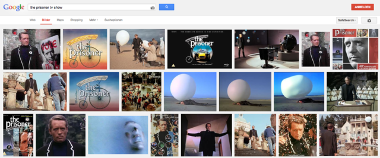
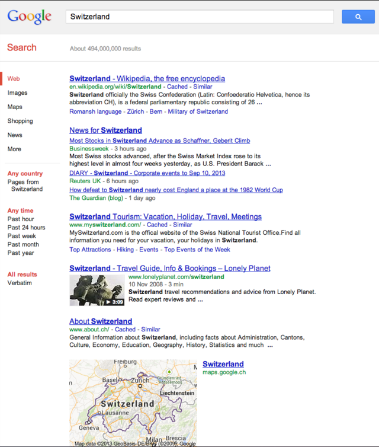
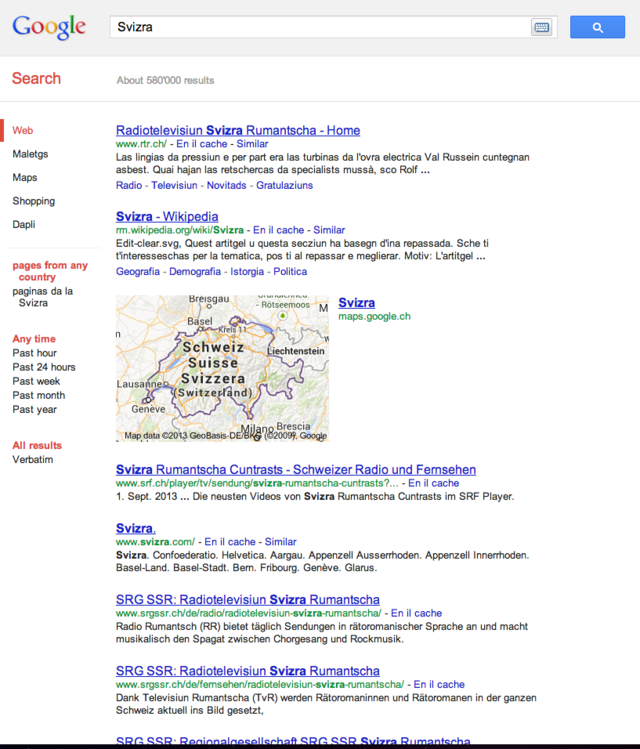
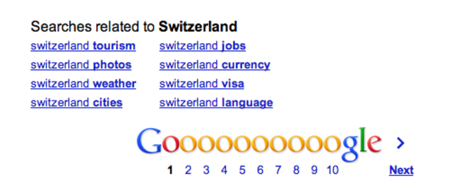
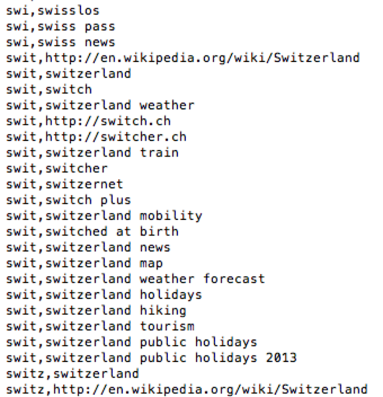

Imagine a world in which all your questions meet calculated answers
defined and achieved by an opaque process. A place where your various
interrogations are tracked and stored so that the knowledge the system
possesses about you is continuously refined. Your behavior, centers of
interest, habits, and languages are endlessly monitored, collected, and
transmitted to a secret, remote command center.

That command center, which provides a massive map of the known world,
gathers information about all the inhabitants of this place. The scope
and the ramifications of the actual use of that massive intelligence
remain unknown to you, but you are told that everything is geared
towards collective benefits. Indeed, the system supports its users and
spares no effort to organize and offer seamless access to varied
information about any topic you seek to explore. Moreover, it has been
designed in a way which helps you to stay focused by filtering out
pieces of information that it has decided are of limited use for your
future projects. The system ‘cares’ so much about your precise
understanding of the world that it will even try to anticipate your
questions. In order to smother unfiltered social interactions and
increase its own efficiency, the system will also strongly suggest a
transparent digital classification of individual identities.

While most people thrive within the system, a few lonely inhabitants are
resisting. Nostalgic for their former world, these individuals try not
to share their personal information, although the system episodically
tries to trick them into doing so. A typical hardcore resister keeps
raising critical questions about the opaque management of the command
center and is tirelessly trying to find out which intelligence agencies
might actually benefit from the collected data. He takes a symbolic
stance and refuses the digital identity that he has been assigned.

Overall, the reach of the system seems all-encompassing, except for
those who are limited by it and are subtly, and sometimes forcefully,
brought back within its realms, as it is in the system’s interest to
keep people within boundaries.

No, this is not necessarily the description of the ‘Googlization of
everything’,[^1] despite its resemblance, but a
condensed summary of the universe of the late sixties cult TV series
*The Prisoner*. The hero of the show, a former spy, tries to make sense
of a new world where he has been abducted, a tidy seaside holiday
village apparently controlled by a secret organization, the goal of
which is to extract the information of intelligence agents.

Like many successful science fiction stories, this work has become, over
time, a generic metaphor used to deconstruct different forms of
confinement.[^2] While the universe of the TV series is
quite remote from any actual stakes raised by information technologies,
we nevertheless consider the depicted organization of the village (the
‘system’) a stimulating entry point to a critical discussion about our
current relationship with search engines.

We will therefore examine in more detail the forms of confinement
enabled by Google, their organization, and their performativity with
regard to accessing content through this service. We begin not from a
small village but from a word, in order to understand how it is
processed by passing through the ‘mills’ of Google.

##Why Words Matter for Google

Google’s search algorithms determine the relevance of websites for
particular search terms. More specifically, they determine which search
results (links, pictures, videos, etc.) seem to be most relevant for
particular search terms for a particular user.[^3] And
while other attributes such as technical specificities of a website or
geographical location are taken into account, Google depends heavily on
words because they are the base of any query.[^4] The
query terms trigger search results, which are links to webpages that
have been evaluated according to keywords as well as to the words in the
anchor text of the pages pointing at them. In order to display the most
relevant search results for a user, Google evaluates the relevancy of
potential search results for this user's initial query terms. Since most
query terms consist of only two to three words,[^5]
Google depends on understanding the meaning of these words as accurately
as possible; its algorithms are iterative and ‘learn’ whether or not the
association between a certain query term and search results is adequate.

The importance of written language to the way Google works cannot be
understated. Even content which is *a priori* not text – e.g. images and
videos – will be indexed, ranked, and searched for in terms of the words
that are associated with it: title, file name, description, tags,
meta-text, etc. Nothing in this world, supposedly, escapes the
possibility of being represented with words. The underlying paradigm of
the way Google works is a ‘semantic determinism’: the vision of a world
where everything that exists can and will be expressed through the
symbolic form of words… and then be indexed by Google.

But Google does not only depend on words for the constitution of its
index. Words are also a *commodity* the company earns money with,
because Google has commodified words by offering advertisers the
opportunity to bid on certain search terms with which they want their
ads associated.[^6] Indeed, the entire company, Google
Inc., owes almost its entire revenue – tens of billions of dollars each
year – to advertising.[^7] It is on Google’s platform
AdWords that advertisers are presented with a price-list for search
terms they could potentially associate their ad with.

The very same search terms that trigger previously indexed web search
results (websites, links, pictures, videos, etc.) *also* trigger ads that
are displayed at the same time. These ads have been esteemed ‘relevant’
with regard to the search terms by advertisers who have bid on these
words, as well as by Google, which evaluates relevance within the
*Quality Score* attributed algorithmically to each
ad.[^8] The process of commodification of words is
thus not only the transformation of words into monetary value; it is
also the (re-)production of representations by linking words and
meaning. And, words have the highest value for Google when their meaning
can unambiguously be determined and commodified.

##What is 'Switzerland'?

We have decided to explore how ‘meaning’ is attributed to a word by
undertaking a case study of the (in-)visibility of the categorization of
one particular word by Google. As will become obvious below, the
linguistic particularities of Switzerland provide an ideal context for
our exploration.

Our case study starts with the following question: What is
*Switzerland*? Isolated, the word Switzerland is free from meaning,
because it is only the usage, contexts, and intentions that will assign
meaning to the word.[^9] For Switzerland, Wikipedia’s
disambiguation page already lists about a dozen possibilities to begin
with. Then, consider how a particular meaning of Switzerland may or may
not be equivalently expressed by e.g. *Schweiz* (in German) or *Suisse*
(in French). Finally, think of all the different meanings Switzerland
can have for individual people.

If one types 'Switzerland' into Google’s search query field, there is no
disambiguation – only web search results and ads. (Plus search options,
which actually add to the lack of transparency rather than act as a
remedy for it, as we will see later.) Of course, results will be shaped
according to profiling, (personalization, localization, language
settings, etc.), and in 2011, Eli Pariser has brought mainstream
attention to what he named the filter bubble: the focus on *the Google
search results we are not getting*due to personalized
filtering.[^10] Our case study, however, shows that
the phenomenon goes beyond a personal filter bubble impacting
individuals. The Google search results we are *not* getting are a
symptom of a complex dispositive based on linking words and their
meaning: a symptom of a semantically determined lifeworld imposed on us,
without transparency, on various levels.

##'Switzerland' in Switzerland

What happens if you search for the word 'Switzerland' in Switzerland?
Well, it depends. Switzerland is a polyglot country. There are four
official languages (German, French, Italian, and Romansh) and English is
widely used as well.

The default language option for Google’s Swiss search portal, google.ch,
is set to German. But if your browser settings allow
cookies,[^11] google.ch can – and according to your
general settings will – be used in any other of those five languages. It
goes without saying that our case study is based on the most general
options, allowing for as little personalization as possible with
available settings (e.g. no browser or search history), which does not
exclude the possibility that people use platforms in a specified
language. Let’s first search for 'Switzerland' on Google Switzerland,
the English version of google.ch, because there are many plausible
scenarios where someone’s language settings are set to English.

Further, let’s see what happens when the language settings were set to
German, French, Italian, or Romansh, and search again for 'Switzerland'
on google.ch. The results on the search engine results page (SERP) are
not identical, although Wikipedia, tourism promotion portal
MySwitzerland.ch, and about.ch turn up on each SERP, albeit in slightly
different ways.[^12]

According to Google’s web search results, the word Switzerland is most
closely related to tourism (MySwitzerland, Lonely Planet), a
geographical entity (map), and a Wikipedia entry. The google.ch in
French and German puts links to MySwitzerland on top, whereas in other
languages Wikipedia is first. The SERP of
Google Switzerland features ‘News for Switzerland’, a different set of
results than the general ‘web results’ (including all results from any
country, any time, as the settings to the left indicate). ‘News for
Switzerland’ shows up solely on Google Switzerland. This is already a
first indicator that the word 'Switzerland' is interpreted in a
different manner by Google according to the language of the interface.

The particular result of ‘News’ brings us to the next question: what if,
in fact, we are searching for specific kinds of results? I might
actually be looking only for news, images, or videos. Suddenly, the very
same word triggers very different results, depending on the language
settings for google.ch.

Video search results on Google Switzerland consist mainly of travel and
tourism videos (dating from 2008-2013), plus three videos about recent
events (Oprah’s visit in Zurich and a football match). The search for
the very same word on Google Schweiz shows striking differences: the
results consist mainly of videos in German about a Swiss TV singing
show, plus one about a sports event and travel information.

You might say that different language settings lead to different search
results because the search results are based on the language settings.
Indeed, this is how Google works; it assumes that our language settings
are a manifestation of the search results we seek. Why would anyone use
Google Schweiz if they did not privilege German language results?

There are at least two problems with this reasoning:

*​1. It is not true!*
The assumption that language settings always state individual language
preference is simply wrong. In Switzerland, a small polyglot country
with four co-existing official languages, plus English being the lingua
franca on the internet, there are many reasons why someone might be
using Google in a certain language without wanting results to be
filtered according to this specific language setting. An important
illustration of this wrongful assumption is Google’s default of German
for most Swiss IP addresses.[^13] As a result, people
from the French or Italian speaking part of Switzerland have to use
Google Schweiz (in German) if they are browsing as privately as possible
and not allowing cookies. Or someone may, for example, own a personal
computer with English language settings, yet their workplace computer is
set to German. Why would this person be looking for inherently different
information when googling Switzerland depending on which computer she is
using? Neither geographical location nor language settings can
unambiguously predict a user’s actual language preference.

*​2. It is patronizing and misleading!*
Have you noticed the settings to the left of the SERPs? Whatever
language setting is enabled, the search settings state that the results
come from the ‘web’, without limitation. Furthermore, it is mentioned
that it is possible on Google Schweiz to limit the results from German
websites – nowhere does it say that the results have already been
filtered based on language. Users are made to believe that the language
setting applies only to the interface, not the results.

But does this really matter? Someone who wants to find videos related to
Switzerland other than the TV show ‘Voice of Switzerland’ will keep
looking, won’t they? This presupposes that people already know what
search results they want, which is far from being the default case and
is especially not true when we search for news – by definition recent
items of information we might not yet know. Checking out Google search
results for news, the difference between the English google.ch and the
German google.ch is striking. Again, to the left of the results Google
suggests that these results have not yet been filtered based on language
nor on country of origin.[^14]

##'Switzerland' in Switzerland in Swiss Languages

Up to this point, we have been searching for a single word:
'Switzerland'. Already, search results for the word's English expression
have been seen to depend on the platform (or language setting) on which
the term is entered, despite all of them coming under the umbrella of
the local Google portal, google.ch. In what way do things change if we
search on each platform in the respective language?

For 'Schweiz', 'Suisse', and 'Svizzera', Wikipedia and MySwitzerland.ch
are constant results, as well as a map of Switzerland. In addition, each
SERP integrates News as a second search result, but similarities in the
results end here. Where the official political portal admin.ch appears
both on Google Suisse and Google Svizzera, it is absent from Google
Schweiz.

The SERP of 'Svizzera' on Google Svizzera highlights images as well,
which differs from Google Schweiz and Google Suisse. And whereas news
sources on Google Schweiz and Google Suisse are actually Swiss, Google
Svizzera displays news only from Italian (!) media. Yet another very
different world is the one of Google Svizra: most of the results are
websites of national media stations.

Maybe we should not be surprised to get different results. Ethan
Zuckerman writes:

>When we look for information through most search engines, the language
we use to build a query limits the results we get. Search Google in the
United States for “apple” and you won’t get the same results as you
would get by searching for the Spanish equivalent, “*manzana*,” on
Google.mx. This makes sense, of course – many of the people searching in
the United States would prefer English-language results. But this
limitation can constrain what information is
available.[^15]

Indeed, this ‘constraint’ on the availability of information is very
real. It is even more important in our case, considering that our
examples all come from one single platform (google.ch), i.e. from the
same country. Is it still appropriate to declare what ‘makes sense’
based on majorities? The Swiss law defines four official languages
without privileging one over the others – is it acceptable that citizens
of the *same* country get different information depending on the
language they use?

##What Is in Switzerland Stays in Switzerland

‘So what?’ you might say. If we are looking for different pieces of
information than we are presented with, all we have to do is search
again, search differently… But in practice, our next search will most
probably not be independent of our first query, even without taking into
account filter bubble issues. If our keywords do not trigger the results
we expect, we will adjust our search by modifying or adding a keyword.
We might not even have to type; Google’s ‘Related Searches’ are just a
click away.

Have you ever misspelled a word in the search query field? Google’s
algorithms will immediately ask ‘Did you mean…?’ and suggest the
corrected word. Even without misspelling, Google’s autocompletion will
suggests words and expressions to us *before we finish typing*. Thus,
these algorithms mediate semantically between what we *mean* and which
*words* we will use to describe it. All of them are so-called
‘linguistic prosthesis’, potentially impacting the written expression of
our thoughts.[^16]

Just as Rover, the big white balloon, prevents the Prisoner from leaving
the village, algorithms may prevent a user’s potential search queries
from escaping the lexicon with which they are familiar by suggesting
words whose meanings make sense for Google. The algorithms create and
impose their own invisible hermeneutics by interpreting words, reframing
queries, and shaping entire semantic fields according to their own
rules-based associations of words and their meaning.

##Behind the Scenes: How Words Are Grouped and Sold

Remember how a Google search triggers not only search results but also
ads? On Google AdWords, advertisers can consult Google’s ranking of
keywords, including their popularity and estimated price (cost per
click, or CPC) on the Keyword Planner (formerly known as Keyword Tool),
and are able to buy keywords; i.e. bid on those with which they would
like to associate their ad.[^17]

It might not be a surprise that the way the Keyword Planner deals with
words is limiting and far from transparent. The Keyword Planner is not
transparent for the same reasons that the search above has shown:
because the Keyword Planner presents groups and lists of words without
explaining how the lists were established. The Planner is limiting
because words and expressions find themselves categorized in certain
groups of meanings, thereby dismissing other interpretations.

Google suggests certain things as pertinent Ad group ideas related to
the keyword 'Schweiz' for all languages and all locations. The Ad group
ideas are sorted ‘by relevance’; it is not entirely clear how this
relevance has been established however. As for the categorizing, it
appears rather arbitrary. Why would ‘Wohnungen Schweiz’ (‘Appartments
Switzerland’) be in ‘Schweiz Sehenswürdigkeiten’ (‘Switzerland Sights’)
rather than in ‘Schweiz Immobilien’ (‘Switzerland Realties’)? How can
‘der Schweiz’ (‘the Switzerland’, using a wrong article) be a category?
What is the difference between the categories ‘Jobs Schweiz’ (Jobs
Switzerland) and ‘Stellenangebote’ (‘Job Offers’)? Why is ‘Schweizer’
(‘Swiss’) a category on its own, including keywords such as ‘Schweizer
Wetter’ (‘Swiss Weather’), which would make more sense within ‘Wetter
Schweiz’ (‘Weather Switzerland’)? These examples are evidence of a
tremendous lack of semantic understanding, which does not prevent the
platform from patronizing users by suggesting these (non-)categories as
valuable information to be taken into account.

Another striking aspect are the different ad prices: the suggested price
for 'Schweiz' is 0.66 CHF, the one for 'Switzerland' 0.41 CHF, for
'Suisse' 0.35 CHF, for 'Svizzera' 0.2 CHF, and no suggested price for
'Svizra'.

It may not be surprising that the prices, Ad group and keyword ideas for
'Schweiz', 'Suisse', 'Svizzera', 'Svizera', and 'Swizerland' are not
congruent. After all, Google probably bases its suggestions on people’s
search queries and the potential search results, and people who search
in a certain language might be more likely to look for a specific topic
than people searching in another language. When many people searching
for 'Svizzera' are looking for work-related results, Google’s algorithms
will deem everything around ‘lavoro/lavorare in Svizzera’ (‘work in
Switzerland’) to be most relevant for the query 'Svizzera'. If most
people searching for 'Schweiz' do so with regard to tourism or housing,
this will be reflected in what Google associates with 'Schweiz'. This
seems logical, but the problem lies in the fact that we find ourselves
very quickly confined within a world of meaning based on our language
preference, constantly confronted with supposedly relevant meanings
established through algorithmic procedures. No disambiguation, no
freedom, and no accountability, only conformity.

##The ‘Word Selling’ Business Becomes a Trade of ‘Meaning’

*The Prisoner* illustrates with astonishing accuracy our relationship
with Google by raising crucial questions: What processes are shaping our
representation of the world? Who is in charge? Why is it impossible to
get away? What does it mean to be free? *The Prisoner* finds himself
trapped in a pleasant yet mysterious village where everyone refers to
him as ‘Number Six’. He opposes that designation, proclaiming ‘I am not
a number. I am a free man.’

It is in the same spirit that we criticize Google for erasing the
distinction between *words* and *meaning*. A complex structure of
integrated processes offers its own fragmented and oriented
interpretation of the world through query results proposed as relevant,
accurate, and meaningful. While answers to users’ queries are rephrased
or reframed by obscure rules and words proposed as packages, a major
shift occurs: the words selling business become a trade of meanings.
From Saussure to Wittgenstein, Berger, Luckmann, and beyond, countless
scholars have pointed out how power structures are reflected by, built
into, and maintained through language. The fundamental question is,
then, what kind of power is embedded in Google’s deconstruction and
contextual reconfigurations of words such as 'Switzerland'?

A first answer could be found if we look at *The Prisoner’*s village.
What is most disturbing is not the display of power and control over
information that we can actually see, but those that are concealed, out
of reach. We still have limited technical and theoretical tools with
which to understand how information is processed within
Google.[^18] Moreover – not unlike Lewis Mumford’s
concept of mega-machines – we know that we are an active part of a huge,
epistemic infrastructure that includes rulers and managers, yet the
different roles and the responsibilities are blurred. The lack of
transparency and accountability of Google, by pretending to simply
mirror the collective actions of its users, sets an asymmetric power
relationship. This discourse constructed and maintained through
practices operates like a mega-machine:

>The perception of the system as providing the limits to action (and
possibility) rather than an actual (locatable) ruler, helps authority
defuse most of the resistance from democratic technics. This is not to
argue there are not individuals or groups with power in society but,
that such power is partly masked by the technological system’s
"needs".[^19]

A second level of power is economic, and this is explicitly at play when
considering the strategic moves of major web companies. Various
information retrieval systems – search engines in their many forms –
find themselves at the core of a long-lasting struggle for influence,
still largely dominated by Google, over the booming capitalist economy
of word commodification. While it is impossible to assess how this
domain will evolve, such confrontations by search engines overwhelmingly
operated by business-oriented private companies challenge the very idea
of common good.

Finally, at a more fundamental level, endeavours to control and market
questions, answers, words, and meaning could also be perceived as a
major shift in the way we think as a society. In his book *The Order of
Things*, Michel Foucault defines the concept of *episteme* as ‘the
strategic apparatus which permits of separating out from among all the
statements which are possible those that will be acceptable within, I
won’t say a scientific theory, but a field of scientificity, and which
it is possible to say are true or false’.[^20] While
Foucault refers to change in modern society and the rise of science as
the leading way to conceptualize the world, we might ask ourselves to
what extent do hundreds of billions of monthly queries, with their
processed answers, participate in the framing of our collective way of
recognizing what is ‘possible’ and what is ‘acceptable’. The issue here
is not about a kind of censorship or about voluntary control of content
but concerns a much more subtle and distributed influence in which the
ontological status of information depends on its transformation and
translation in the multiple processes we have described above. In other
words, will the *googleability* of a piece of information become a
condition of its social existence?

At this general level, the critical issue in terms of power and
accountability is the search engines' non-visibility. If we accept this
situation as such we would be following the path of the vast majority of
*The Prisoner*’s**village inhabitants: thankful and happy to live in a
cozy, tidy, and artificial place they call their world. However, opening
the ‘black box’ of meaning (re-)production through search engines could
be an unsettling experience as we discover how much we have already
delegated to algorithms and their owners, and how we are all entangled
through our practices. Hopefully, transparency also would lay the ground
for a much needed public debate about how to conceptualize systems where
the (re-)production of meaning is not subordinated to economic
interests. At this point it’s important to remember how the search
engine operates between us and our words.

*NB: All data from Google (i.e. screenshots of SERPs, autocompletion,
Keyword Planner data) were retrieved on 11 September 2013, between
11.30am and 2pm, from Lausanne, Switzerland.*

##References {.references}

Barocas, Solon, Sophie Hood, and Malte Ziewitz. ‘Governing Algorithms: A
Provocation Piece’, *SSRN Scholarly Paper*, Rochester, NY: Social
Science Research Network (2013), http://ssrn.com/abstract=2245322 or
http://dx.doi.org/10.2139/ssrn.2245322.

Cain Miller, Claire. ‘Google Is Exploring an Alternative to Cookies for
Ad Tracking’, *The New York Times Bits Blog*, 19 September 2013,
http://bits.blogs.nytimes.com/2013/09/19/google-is-exploring-an-alternative-to-cookies-for-ad-tracking/.

Feuz, Martin, Matthew Fuller, and Felix Stalder. ‘Personal Web Searching
in the Age of Semantic Capitalism: Diagnosing the Mechanisms of
Personalisation’, *First Monday* 16.2 (2 July 2011),
http://firstmonday.org/htbin/cgiwrap/bin/ojs/index.php/fm/article/view/3344/2766.

Fuchs, Christian. ‘A Contribution to the Critique of the Political
Economy of Google’, *Fast Capitalism* 8.1 (October 2011),
http://www.uta.edu/huma/agger/fastcapitalism/8\_1/fuchs8\_1.html.

Google.com. Check and Understand Quality Score - AdWords Help,
https://support.google.com/adwords/answer/2454010?hl=en.

Grimmelmann, James. ‘The Google Dilemma’, *New York Law School Law
Review* 53.939 (2009), http://works.bepress.com/james\_grimmelmann/19.

Jobin, Anna and Frederic Kaplan. ‘Are Google’s Linguistic Prosthesis
Biased Towards Commercially More Interesting Expressions? A Preliminary
Study on the Linguistic Effects of Autocompletion Algorithms’, *Digital
Humanities 2013 Conference Abstracts*, Lincoln, NE: Center for Digital
Research in the Humanities, 2013, p. 245-248.

Lee, Micky. *Free Information? The Case Against Google,* Champaign:
Common Ground Publishing, 2010.

Lewandowski, Dirk (ed.). *Web Search Engine Research*, Bingley: Emerald
Group Publishing Ltd., 2012.

Manovich, Lev. *Software Takes Command: Extending the Language of New
Media,* New York; London: Bloomsbury, 2013.

May, Christopher. ‘The Information Society as Mega-Machine’,
*Information, Communication & Society* 3.2 (2000): 241-265.

Pariser, Eli. *The Filter Bubble: What the Internet Is Hiding from You,*
London: Penguin Books Ltd., 2011.

Röhle, Theo. *Der Google-Komplex: Über Macht Im Zeitalter Des
Internets,* Kultur- Und Medientheorie, Bielefeld: Transcript, 2010.

Sérisier, Pierre. *Le prisonnier: sommes-nous tous des numéros?* Paris:
PUF, 2013.

Vaidhyanathan, Siva. *The Googlization of Everything (And Why We Should
Worry)*, Berkeley: University of California Press, 2011.

Viltar, Yves. ‘L’étrange carrière du concept foucaldien d’épistémè en
science politique’, *Raisons Politiques* 23.3 (2006): 193-202.

Vygotskij, Lev S. *Denken und Sprechen: psychologische Untersuchungen*,
trans. Joachim Lompscher and Georg Rückriem, Weinheim; Basel: Beltz,
2002.

Zuckerman, Ethan. *Rewire: Digital Cosmopolitans in the Age of
Connection*, New York: W.W. Norton & Company, 2013.

##Notes {.notes}

[^1]: Siva Vaidhyanathan, *The Googlization of Everything (And Why We
    Should Worry),* Berkeley: University of California Press, 2011.

[^2]: Pierre Sérisier, *Le prisonnier: sommes-nous tous des
    numéros?*Paris: PUF, 2013.

[^3]: Cf. e.g. James Grimmelmann, ‘The Google Dilemma’, *New York Law
    School Law Review* 53.939 (2009),
    http://works.bepress.com/james\_grimmelmann/19. Or Martin Feuz,
    Matthew Fuller, and Felix Stalder, ‘Personal Web Searching in the
    Age of Semantic Capitalism: Diagnosing the Mechanisms of
    Personalisation’, *First Monday* 16.2 (July, 2011),
    http://firstmonday.org/htbin/cgiwrap/bin/ojs/index.php/fm/article/view/3344/2766.

[^4]: Admittedly with the exception of image search based on an existing
    image, a lesser known and comparatively little used feature.

[^5]: Dirk Lewandowski, ‘New Perspectives on Web Search Engine Research’,
    in Dirk Lewandowski (ed.) *Web Search Engine Research*, Bingley:
    Emerald Group Publishing, 2012, p. 4.

[^6]: Cf. Micky Lee, *Free Information? The Case Against Google*,
    Champaign: Common Ground Publishing, 2010. And Theo Röhle. *Der
    Google-Komplex: Über Macht Im Zeitalter Des Internets*, Bielefeld:
    Transcript, 2010.

[^7]: Christian Fuchs, ‘A Contribution to the Critique of the Political
    Economy of Google’, *Fast Capitalism*8.1 (October, 2011),
    http://www.uta.edu/huma/agger/fastcapitalism/8\_1/fuchs8\_1.html.

[^8]: Check and Understand Quality Score — AdWords Help, Google,
    https://support.google.com/adwords/answer/2454010?hl=en.

[^9]: Lev S. Vygotskij, *Denken und Sprechen: psychologische
    Untersuchungen*, trans. Joachim Lompscher and Georg Rückriem,
    Weinheim; Basel: Beltz, 2002.

[^10]: Eli Pariser, *The Filter Bubble: What the Internet Is Hiding from
    You,* London: Penguin Books Ltd., 2011.

[^11]: In September 2013, Google announced that the company intends not to
    rely on cookies anymore in the near future (cf. Claire Cain Miller.
    ‘Google Is Exploring an Alternative to Cookies for Ad Tracking’, The
    New York Times Bits blog*,* 19 September 2013,
    http://bits.blogs.nytimes.com/2013/09/19/google-is-exploring-an-alternative-to-cookies-for-ad-tracking/).

[^12]: Pictures are available in an online appendix, see
    networkcultures.org/publications.

[^13]: Even distinct regional defaults would provide no solution because
    many Swiss IP addresses are generated dynamically and thus indicate
    the internet provider's, not the location of a user.

[^14]: See the screenshots on networkcultures.org/publications for a
    side-by-side comparison.

[^15]: Ethan Zuckerman, *Rewire: Digital Cosmopolitans in the Age of
    Connection*, New York: W. W. Norton & Company, 2013, pp. 164-165.

[^16]: Anna Jobin and Frederic Kaplan, ‘Are Google’s Linguistic Prosthesis
    Biased Towards Commercially More Interesting Expressions? A
    Preliminary Study on the Linguistic Effects of Autocompletion
    Algorithms’, *Digital Humanities 2013 Conference Abstracts*,
    Lincoln, NE: Center for Digital Research in the Humanities, 2013,
    pp. 245-248.

[^17]: According to Micky Lee, *Free Information?*, both the providing of a
    ranking and the commodification of keywords are part of the three
    main values Google sells to the advertisers, the third being the
    Google Search user's attention.

[^18]: Which is why we agree with Lev Manovich ( Software Takes Command:
    Extending the Language of New Media, New York and London:
    Bloomsbury, 2013) and Barocas et al. (Solon Barocas, Sophie Hood,
    and Malte Ziewitz, ‘Governing Algorithms: A Provocation Piece’, SSRN
    Scholarly Paper , Rochester, NY: Social Science Research Network
    (2013), http://ssrn.com/abstract=2245322 or
    http://dx.doi.org/10.2139/ssrn.2245322 ) that the study of software
    and, more fundamentally, algorithms deserves our utmost attention.

[^19]: Christopher May, ‘The Information Society as Mega-Machine’,
    *Information, Communication & Society* 3 (2000): 251.

[^20]: Michel Foucault, quoted by Yves Viltar, ‘L’étrange carrière du
    concept foucaldien d’épistémè en science politique’, *Raisons
    Politiques* 23 (2006): 3.

